# World's hardest game
- Game demo : https://youtu.be/ukrjVZZDmz8
# Giới thiệu chung
**World's hardest game - Trò chơi khó nhất thế giới** là một trò chơi thuộc thể loại qua màn. Nhiệm vụ của bạn rất đơn giản : điều khiển khối vuông màu đỏ vượt qua các chướng ngại vật (các chấm màu xanh), đồng thời thu thập tất cả các đồng xu vàng cần thiết để qua màn. Game có tổng cộng 15 màn tất cả, với độ khó tăng dần đến mức bạn sẽ phải đập bàn phím sau khi chơi được một lúc. 

- [0. Cách tải game](#0-cách-tải-game)
   * [0.1 Không bao gồm code](#01-không-bao-gồm-code)
   * [0.2 Bao gồm code và có thể biên dịch](#02-bao-gồm-code-và-có-thể-biên-dịch)
- [1. Bắt đầu game](#1-bắt-đầu-game)
- [2. Chọn chế độ](#2-chọn-chế-độ)
- [3. Chọn màn](#3-chọn-màn)
- [4. Chọn độ khó](#4-chọn-độ-khó)
- [5. Các thành phần trong game](#5-các-thành-phần-trong-game)
- [6. Hướng dẫn chơi game](#6-hướng-dẫn-chơi-game)
- [7. Qua màn](#7-qua-màn)
- [8. Về cơ chế hoạt động của game](#8-về-cơ-chế-hoạt-động-của-game)
- [9. Credits](#9-credits)
# 0. Cách tải game
## 0.1 Không bao gồm code

Tải game (được nén thành file zip) tại link :  
Giải nén game vào một thư mục, khởi động file **World's hardest game.exe** rồi tận hưởng game thôi nào !!!

## 0.2 Bao gồm code và có thể biên dịch

**Bước 1**: Clone repo này về (ở nhánh master 2) 
**Bước 2**: Tải IDE Visual Studio tại [đây](https://visualstudio.microsoft.com). Kéo xuống rồi chọn bản Community 2022 rồi tải về. 
**Bước 3**: Cài đặt thư viện `SDL2` tại [đây](https://lazyfoo.net/tutorials/SDL/01_hello_SDL/windows/msvc2019/index.php). Áp dụng tương tự với các thư viện mở rộng như `SDL2_image`, `SDL2_ttf`,`SDL2_mixer`. 
**Bước 4**: Khởi động file **World's hardest game.sln**, sau đó chạy biên dịch và tận hưởng game thôi nào !!!

# 1. Bắt đầu game
Khi vào game, một intro game sẽ hiện ra trong vòng 5 giây. 

Sau đó, giao diện game sẽ giống như sau: 

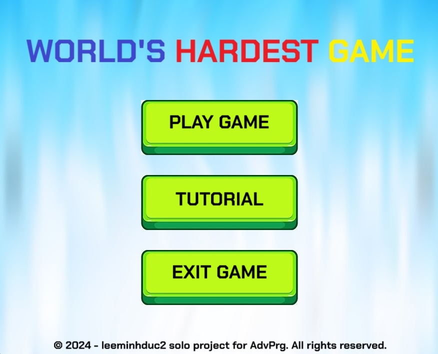

Khi bạn di chuyển chuột vào nút tương ứng, dòng chữ sẽ thay đổi từ màu trắng/đen thành màu đỏ đậm.

- Nếu bạn muốn bắt đầu chơi game , hãy bấm vào nút **PLAY GAME** .
- Nếu bạn muốn đọc hướng dẫn chơi và điều khiển game, hãy bấm vào nút **TUTORIAL**.
- Nếu bạn muốn thoát khỏi trò chơi, hãy bấm vào nút **EXIT GAME**.

# 2. Chọn chế độ
Có hai chế độ: chế độ Speedrun và chế độ Level Select. 

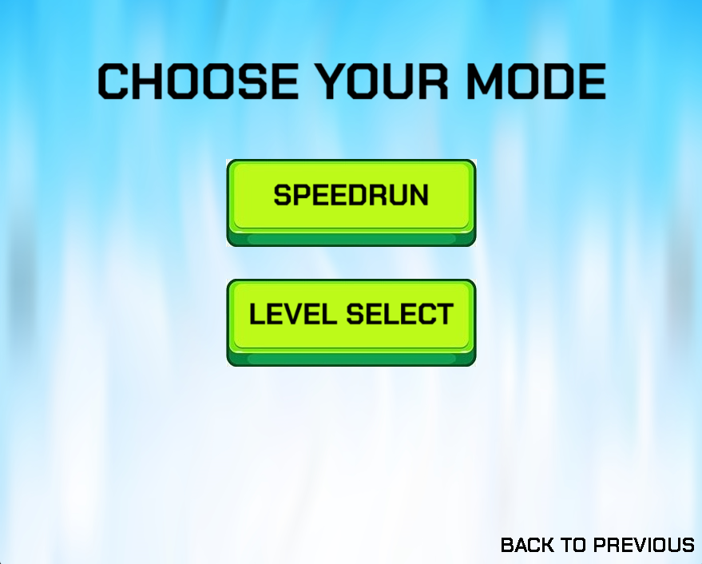

Ở chế độ Speedrun, bạn sẽ phải vượt qua tất cả các màn trong trò chơi với thời gian nhanh nhất có thể. Nếu bạn cần tập luyện từng màn để chơi Speedrun, bạn có thể chọn chế độ Level Select. Khi đó, giao diện chọn màn sẽ hiện lên.

Lưu ý rằng, nếu bạn muốn quay trở lại giao diện menu chính, bạn có thể bấm vào nút **BACK TO PREVIOUS** hiện ở góc phải dưới của màn hình. 

- Để chọn chế độ Speedrun, hãy bấm vào nút **SPEEDRUN**.
- Để chọn chế độ Level Select, hãy bấm vào nút **LEVEL SELECT**.
# 3. Chọn màn
Nếu bạn chọn chế độ chọn màn, giao diện chọn màn sẽ hiện ra như sau:

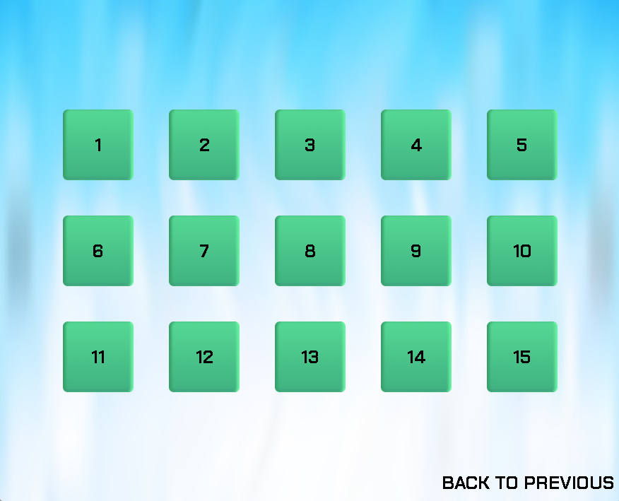

Trò chơi sẽ bao gồm 15 màn tất cả, với độ khó tăng dần theo số màn hiện tại đến mức khó không thể tin nổi. 

Để chọn màn, di chuyển chuột đến ô màn tương ứng bạn muốn chọn. Sau đó chọn ô màn đó. Bạn cũng có thể chọn quay lại giao diện chọn chế độ bằng cách bấm vào nút **BACK TO PREVIOUS** hiện ở góc phải dưới của màn hình. 

# 4. Chọn độ khó
Có hai độ khó: dễ và khó. 

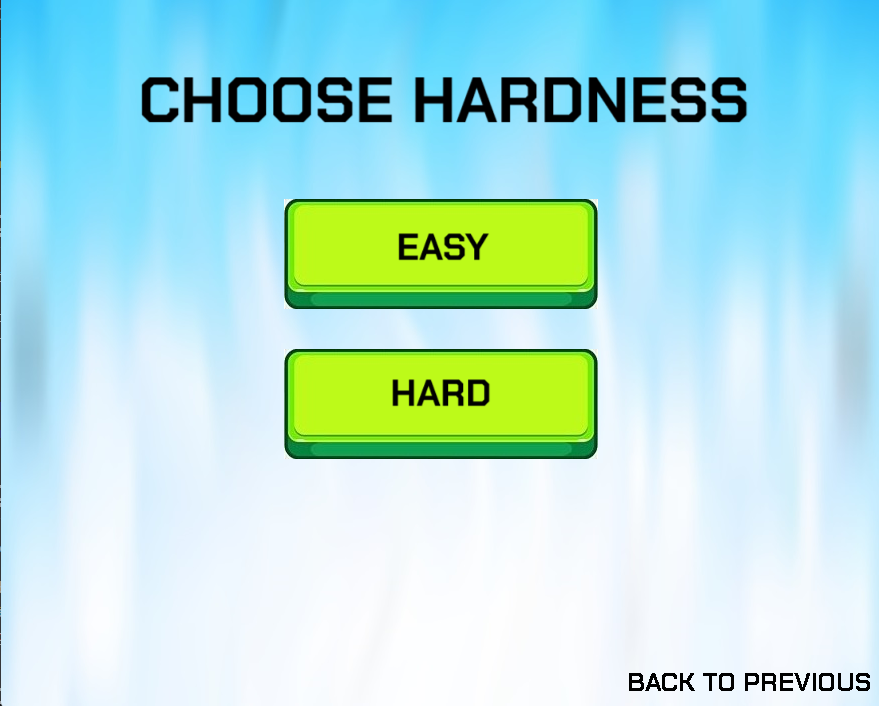

Ở chế độ dễ, các chướng ngại vật sẽ di chuyển chậm hơn, do đó sẽ dễ dàng qua màn hơn. Ở chế độ khó, tốc độ của chướng ngại vật sẽ tăng lên gấp đôi, khiến cho việc vượt qua các chướng ngại vật trở nên khó hơn. 

- Để chọn chế độ dễ, bấm vào nút **EASY**.
- Để chọn chế độ khó, bấm vào nút **HARD**.
Nếu bạn muốn đổi chế độ chơi game hay muốn thay đổi màn chơi hiện tại (ở chế độ chọn màn), hãy bấm vào nút **BACK TO PREVIOUS** hiện ở góc phải dưới của màn hình.  

# 5. Các thành phần trong game
- Bố cục cơ bản của game sẽ như sau:

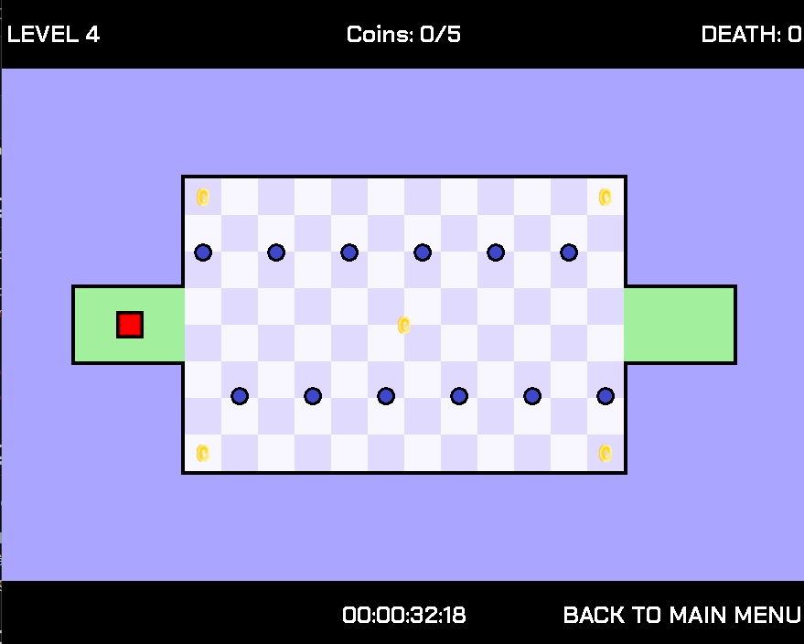

- Khối vuông màu đỏ (Red square): Là nhân vật chính mà người chơi sẽ di chuyển. 
- Chấm xanh (blue dots): Khi người chơi di chuyển vào chấm xanh, khối đỏ sẽ chết và di chuyển lại về khu vực checkpoint đã được lưu trước đó . Các chấm xanh có thể di chuyển theo chu kì hình chữ I, hình chữ L hay bất cứ chu kì nào bạn có thể tưởng tượng.
- Đồng xu (Coins): Là một vật phẩm quan trọng trong game. Để qua màn, bạn cần phải thu thập tất cả các đồng xu có trên bản đồ. Khi di chuyển vào một khu vực checkpoint nào đó, số đồng xu của bạn đã thu thập được sẽ được lưu lại. Lần sau khi chết, bạn sẽ không phải cất công đi nhặt lại những đồng xu kia nữa.
- Level :
-  Bạn có thể xem số màn hiện tại của mình tại góc trên trái của màn hình game.
- Bộ đếm đồng xu (Coin counter) 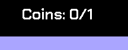
: Bạn có thể xem số đồng xu mình đã thu thập được ở phía giữa góc trên màn hình game.
- Bộ đếm số lần chết (Death counter)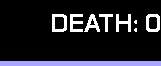
: Bạn có thể xem số lần bạn đã chết ở góc trên trái của màn hình game. Số lượt chết sẽ cộng dồn qua từng màn (ở chế độ Speedrun).
- Bộ thời gian (Timer)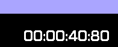
: Bạn có thể xem thời gian mình đã chơi bắt đầu từ lúc bắt đầu chơi tại phía giữa góc dưới màn hình game.
- Nút **BACK TO MAIN MENU**
: Nếu cảm thấy chế độ chơi hiện tại quá khó, bạn có thể chọn quay lại giao diện menu chính của game bằng cách chọn nút trên tại góc phải dưới của màn hình game.
- Checkpoint 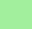
: Có tác dụng lưu lại tiến trình game ở màn hiện tại khi bạn di chuyển khối vuông đỏ vào đây.

# 6. Hướng dẫn chơi game
Sử dụng 4 nút mũi tên &uarr;,&larr;, &rarr; và &darr; để điều khiển khối vuông màu đỏ di chuyển theo ý muốn của bạn. Bạn có thể kết hợp các nút với nhau để có thể di chuyển theo hướng tùy thích. Nhiệm vụ của bạn là vượt qua các chướng ngại vật (các chấm xanh), thu thập tất cả các đồng xu rồi di chuyển đến ô checkpoint cuối cùng để qua màn. 
Nếu bạn cảm thấy màn chơi hiện tại quá khó, bạn có thể bỏ cuộc, hoặc sử dụng **CHEAT CODE** bí mật mà tôi đã giấu trong game để có thể ngay lập tức qua màn.
#  7. Qua màn
Khi bạn qua một màn bất kì, bạn sẽ ngay lập tức được chuyển đến màn tiếp theo. 
Nếu màn hiện tại của bạn là màn cuối cùng của chế độ speedrun, giao diện của bạn sẽ hiện như sau:

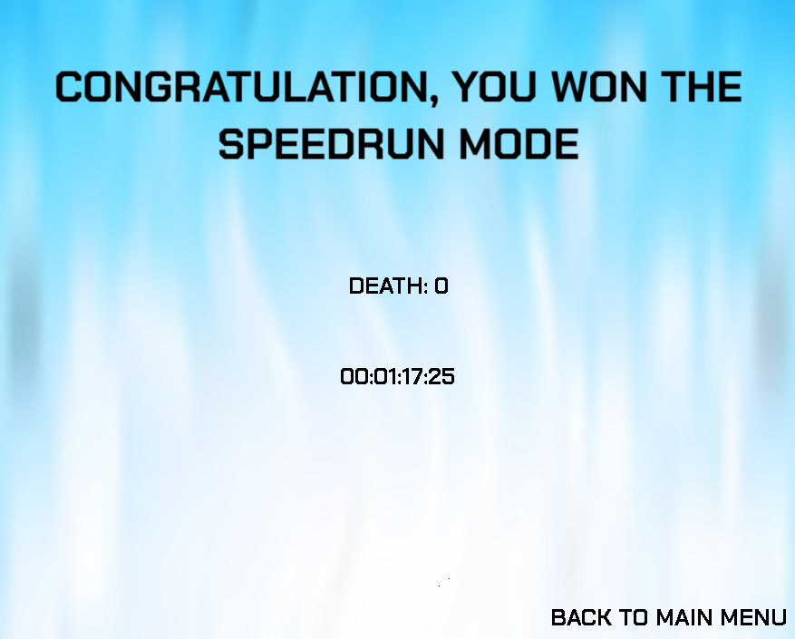

Nếu bạn hoàn thành một màn bất kì trong chế độ Level Select, giao diện của bạn sẽ hiện như sau:

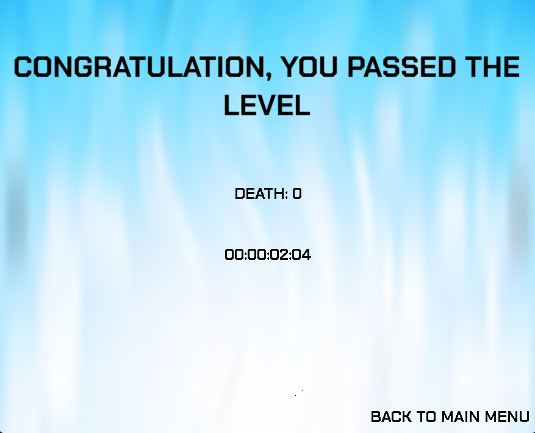

Sau đó, hãy chọn nút **BACK TO MAIN MENU** để quay lại giao diện menu chính của game ở góc phải dưới của màn hình game.

# 8. Về cơ chế hoạt động của game
- Trong file `Coin.cpp` và `Coin.hpp`:
    * cPosX: tọa độ theo chiều ngang của đồng xu.
    * cPosY: tọa độ theo chiều dọc của đồng xu.
    * cTexture: chứa Texture của đồng xu đó.
    * cAlpha: độ sáng của đồng xu.
    * cStatus: Trạng thái của đồng xu (0 nếu chưa bị thu thập, 1 nếu bị thu thập nhưng chưa được lưu, 2 nếu đã bị thu thập và đã được lưu ở checkpoint nào đó).
    * Hàm loadFromFile(): load Texture của đồng xu.
    * Hàm free(): Giải phóng bộ nhớ của đồng xu.
    * Hàm setBlendMode(): Đặt chế độ trộn cho đồng xu.
    * Các hàm setAlpha(), setX(),setY(),... : gán giá trị cho các biến trên.
    * Các hàm getAlphaValue(), getX(), getY(),... : trả về giá trị các biến trên.
    * Hàm render(): xuất hình từ khung hiện tại (current frame).
- Trong file `Movepath.cpp`:
    * isCircular : để nói rằng chấm tròn xanh có di chuyển theo quỹ đạo tròn hay không.
    * Nếu isCircular = 0 thì các biến sẽ có ý nghĩa như sau:
        + xS,yS: tọa độ xuất phát của quỹ đạo di chuyển theo đường thẳng.
        + xF,yF: tọa độ kết thúc của quỹ đạo di chuyển theo đường thẳng.
        + moveTime : thời gian đễ di chuyển hết quỹ đạo.
        + Biến rad sẽ không có ý nghĩa ở đây.    
    * Nếu isCircular = 1 thì các biến sẽ có ý nghĩa như sau:
        + xS,yS: tọa độ tâm đường tròn quỹ đạo di chuyển.
        + xF,yF: góc bắt đầu và góc kết thúc của quỹ đạo di chuyển theo hình tròn.
        + moveTime : thời gian đễ di chuyển hết quỹ đạo.
        + Rad: Bán kính quỹ đạo di chuyển. Nguyên lý ở đây là, chấm tròn sẽ di chuyển xung quanh tâm đường tròn quỹ đạo với bán kính là Rad.
- Trong file `Dot.cpp` và `Dot.hpp`:
    * Mảng pattern: Sử dụng ctdl `Movepath` để lưu quỹ đạo di chuyển của chấm xanh.
    * totaltime: Lưu thời gian di chuyển tổng cộng của các quỹ đạo của một chấm xanh.
    * cTexture: chứa Texture của chấm xanh đó.
    * Hàm addPath(): Thêm quỹ đạo di chuyển vào cuối mảng pattern.
    * Hàm loadImage(): load Texture của chấm xanh.
    * Hàm render(): xuất hình chấm xanh.
    * Các hàm getXS(),getYS(),...: lấy các tham số trong lớp hiện tại.
- Trong file `HUD_Text.cpp` và `HUD_Text.hpp`:
    * HTX, HTY: lưu tọa độ của Texture.
    * HTWidth, HTHeight: lưu chiều dài, chiều cao của Texure.
    * HTTexture: chứa Texture của đồng xu đó.
    * Hàm loadText(): load Texture từ một nội dung văn bản cho trước.
    * Hàm renderText(): xuất hình Texture hiện tại.
    * Các hàm setX(),setY(),... : gán giá trị cho các biến trên.
    * Các hàm getX(), getY(),... : trả về giá trị các biến trên.
- Trong file `HUD_Texture.cpp` và `HUD_Texture.hpp`:
    * Có chức năng tương tự cấu trúc dữ liệu `HUD_Text`, tuy nhiên Texture ở đây sẽ được lấy từ ảnh (image) thay vì nội dung văn bản (text).
- Trong file `Level.cpp` và `Level.hpp`:
    * Hai mảng spawnX, spawnY: lưu tọa độ spawn của các checkpoint trong mỗi màn.
    * Mảng a[][]: Bản đồ của màn hiện tại. Giá trị tại mỗi ô đại diện cho những ý nghĩa như sau:
        + 0 : Ô đó là nền (có màu tím đậm).
        + 1 : Ô đó là vùng di chuyển được (có màu tìm nhạt và màu trắng đan xen lẫn nhau).
        + 2 : Ô đó là vùng checkpoint và đồng thời là khu vực spawn ban đầu của người chơi.
        + 3 : Ô đó là vùng checkpoint và đồng thời là khu vực về đích cần đến.
        + 4+: Ô đó là vùng checkpoint. Bạn có thể lưu tiến trình tại đây.
    * nCheckpoints: Lưu số lượng checkpoint. Checkpoint 1 là khu vực spawn ban đầu, còn checkpoint 2 là khu vực về đích.
    * Bao gồm các hàm có chức năng lấy các tham số như các ctdl trên.
    * Hàm readLevelData(): Có chức năng đọc dữ liệu trong 1 file .txt tùy theo màn hiện tại.
    * Hàm drawMap(): Có chức năng vẽ và xuất map từ dạng số sang dạng hình ảnh lên màn hình.
    * Ngoài ra còn bao gồm các hàm kiểm tra trạng thái của các ô kề trên, dưới, trái, phải để vẽ map.
- Trong file `Player.cpp` và `Player.hpp`:
    * Lưu vị trí hiện tại, gia tốc, trạng thái di chuyển và các tham số khác của người chơi. Đồng thời quản lý điều khiển của người chơi cũng như xử lý các sự kiện khi va chạm thành khu vực di chuyển được hay va chạm các chấm xanh, đồng xu, kiểm soát người chơi (khối vuông đỏ) ở trong vùng chơi di chuyển được, tránh đi ra ngoài vùng nền.
- Trong file `UI.cpp` và `UI.hpp`:
    * Là một ctdl quản lý các ctdl con bao gồm `HUD_Text` và `HUD_Texture`
- Trong file `common.h`:
    * Bao gồm các thư viện cơ bản mặc định, cũng như các hằng số cần thiết của game.
- Trong file `main.cpp`:
    * Có chức năng chính là quản lí vận hành của game. Bao gồm renderer, window, các mix_chunk, mix_music và các biến có kiểu dữ liệu thuộc ctdl trên.
    * Hàm init(): Khởi động các chức năng cơ bản của thư viện `SDL2` cũng như `SDL2_image`, `SDL2_ttf`,`SDL2_mixer`. Đồng thời khởi động các hàm cơ bản để quản lý trò chơi.
    * Hàm closeGame(): Giải phóng bộ nhớ các biến được dùng để quản lí game.
    * Hàm runMainMenu(): Quản lí giao diện menu chính của game.
    * Hàm runTutorialMenu(): Quản lí giao diện hướng dẫn của game.
    * Hàm runModeSelection(): Quản lí giao diện chọn chế độ chơi của game.
    * Hàm runLevelSelection(): Quản lí giao diện chọn màn của game (khi chọn chế độ Level Select).
    * Hàm runHardnessSelection(): Quản lí giao diện chọn độ khó của game.
    * Hàm run(): Quản lí giao diện chơi game chính của game.
    * Hàm runvictoryMenu(): Quản lí giao diện khi người dùng hoàn thành trò chơi.

# 9. Credits
- Thầy Lê Đức Trọng: vì đã giúp đỡ em rất nhiều trong khâu phát triển game.
- Trợ giảng thầy Trần Thủy: vì đã giúp đỡ em trong khâu thiết kế và đóng góp về game.
- Mentor Nguyễn Vũ Thanh Tùng: vì đã giúp đỡ em rất nhiều trong khâu sửa lỗi game, git, github repo.
- Lazyfoo SDL2's tutorial : https://lazyfoo.net/tutorials/SDL/index.php.
- Resources, SFXs and Music : https://github.com/danspage/worldshardestgame/tree/master?tab=readme-ov-file.
- Additional SFXs: https://pixabay.com/vi/sound-effects/.
